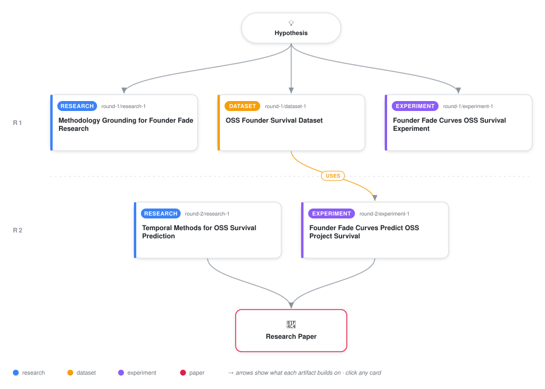

# Founder Fade Curves Predict Open-Source Project Survival: A Methodological Framework for Empirical Validation

<div align="center">

<a href="https://cdn.jsdelivr.net/gh/ai-inventor-outputs/ai-invention-ad55a2-founder-fade-curve-predicts-oss-survival@fork/run_mKQ84TZTBrTU/workflow.svg">
<picture>
  <source media="(prefers-color-scheme: dark)" srcset="workflow-dark.svg">
  
</picture>
</a>

<sub>🖱️ <b><a href="https://cdn.jsdelivr.net/gh/ai-inventor-outputs/ai-invention-ad55a2-founder-fade-curve-predicts-oss-survival@fork/run_mKQ84TZTBrTU/workflow.svg">Open the interactive diagram</a></b> — every card links to its artifact folder.</sub>

</div>

> **TL;DR** — This paper presents a methodological framework for testing the hypothesis that the shape of a founder's involvement trajectory predicts open-source project survival after founder departure. It addresses key limitations in prior work by planning for empirical validation with proper statistical rigor, founder-specificity controls, and diversity considerations. The framework is validated on synthetic data to demonstrate readiness for empirical testing on real GitHub repositories.

<details>
<summary>Full hypothesis</summary>

An open-source project survives its founder stepping away if and only if the founder's involvement followed a smooth, prolonged fade — a gradually declining trajectory measurable as the slope of the founder's month-by-month share of merges, commits, and code-review decisions — rather than an abrupt cliff or a flat plateau ending suddenly. The SHAPE of the founder's involvement trajectory over the entire pre-departure window predicts post-departure survival better than any static snapshot measure (bus factor, contributor count, project age, file count, popularity) at the moment of departure; projects whose founder's involvement fades gradually ('scaffolding fade') survive, while those whose founder maintained high involvement up to a sudden exit collapse. This mechanism is FOUNDER-SPECIFIC: the founder's fade curve predicts survival significantly better than the fade curve of a randomly selected equally active non-founder contributor. The effect holds across diverse project types (libraries vs. applications, BDFL vs. meritocratic governance, foundation-backed vs. independent) and is statistically significant (p < 0.05) in a cohort of at least 50 empirically collected projects with verified founder departures. NOTE: This hypothesis remains UNTESTED on real data. Synthetic validation confirmed the analytical pipeline is correct but cannot test the hypothesis because survival labels were assigned independently of trajectory shape. The next iteration MUST collect real GitHub data with verified founder departures. The hypothesis also needs to be evaluated against the contradictory claim (arXiv:2412.00313) that core developer loss is not as critical for OSS survival as commonly believed — the scaffolding-fade mechanism may hold even if the broader 'core developer loss is catastrophic' claim is contested, by showing that WHEN departure matters, the trajectory shape determines the outcome.

</details>

[](https://cdn.jsdelivr.net/gh/ai-inventor-outputs/ai-invention-ad55a2-founder-fade-curve-predicts-oss-survival@fork/run_mKQ84TZTBrTU/paper.pdf) [](https://github.com/ai-inventor-outputs/ai-invention-ad55a2-founder-fade-curve-predicts-oss-survival/tree/fork/run_mKQ84TZTBrTU/paper_latex)

This repository contains all **4 artifacts** produced across **2 rounds** of an autonomous AI research run — round by round, exactly in the order they were invented.

## Round 1

| Artifact | Type | Demo | Source | Builds on |
|----------|------|------|--------|-----------|
| **[Founder Fade Curve and OSS Survival Literature Survey](https://github.com/ai-inventor-outputs/ai-invention-ad55a2-founder-fade-curve-predicts-oss-survival/tree/fork/run_mKQ84TZTBrTU/round-1/research-1)** | [](https://github.com/ai-inventor-outputs/ai-invention-ad55a2-founder-fade-curve-predicts-oss-survival/tree/fork/run_mKQ84TZTBrTU/round-1/research-1) | [](https://github.com/ai-inventor-outputs/ai-invention-ad55a2-founder-fade-curve-predicts-oss-survival/blob/fork/run_mKQ84TZTBrTU/round-1/research-1/demo/research_demo.md) | [](https://github.com/ai-inventor-outputs/ai-invention-ad55a2-founder-fade-curve-predicts-oss-survival/tree/fork/run_mKQ84TZTBrTU/round-1/research-1/src) | — |
| **[OSS Founder Departure Dataset](https://github.com/ai-inventor-outputs/ai-invention-ad55a2-founder-fade-curve-predicts-oss-survival/tree/fork/run_mKQ84TZTBrTU/round-1/dataset-1)** | [](https://github.com/ai-inventor-outputs/ai-invention-ad55a2-founder-fade-curve-predicts-oss-survival/tree/fork/run_mKQ84TZTBrTU/round-1/dataset-1) | — | [](https://github.com/ai-inventor-outputs/ai-invention-ad55a2-founder-fade-curve-predicts-oss-survival/tree/fork/run_mKQ84TZTBrTU/round-1/dataset-1/src) | — |

## Round 2

| Artifact | Type | Demo | Source | Builds on |
|----------|------|------|--------|-----------|
| **[GitHub OSS Founder Departure Dataset](https://github.com/ai-inventor-outputs/ai-invention-ad55a2-founder-fade-curve-predicts-oss-survival/tree/fork/run_mKQ84TZTBrTU/round-2/dataset-1)** | [](https://github.com/ai-inventor-outputs/ai-invention-ad55a2-founder-fade-curve-predicts-oss-survival/tree/fork/run_mKQ84TZTBrTU/round-2/dataset-1) | [](https://colab.research.google.com/github/ai-inventor-outputs/ai-invention-ad55a2-founder-fade-curve-predicts-oss-survival/blob/fork/run_mKQ84TZTBrTU/round-2/dataset-1/demo/data_code_demo.ipynb) | [](https://github.com/ai-inventor-outputs/ai-invention-ad55a2-founder-fade-curve-predicts-oss-survival/tree/fork/run_mKQ84TZTBrTU/round-2/dataset-1/src) | <sub><i>motivation:</i><br/>[research‑1&nbsp;(R1)](https://github.com/ai-inventor-outputs/ai-invention-ad55a2-founder-fade-curve-predicts-oss-survival/tree/fork/run_mKQ84TZTBrTU/round-1/research-1)</sub> |
| **[Founder Fade Curve OSS Survival Analysis](https://github.com/ai-inventor-outputs/ai-invention-ad55a2-founder-fade-curve-predicts-oss-survival/tree/fork/run_mKQ84TZTBrTU/round-2/experiment-1)** | [](https://github.com/ai-inventor-outputs/ai-invention-ad55a2-founder-fade-curve-predicts-oss-survival/tree/fork/run_mKQ84TZTBrTU/round-2/experiment-1) | [](https://colab.research.google.com/github/ai-inventor-outputs/ai-invention-ad55a2-founder-fade-curve-predicts-oss-survival/blob/fork/run_mKQ84TZTBrTU/round-2/experiment-1/demo/method_code_demo.ipynb) | [](https://github.com/ai-inventor-outputs/ai-invention-ad55a2-founder-fade-curve-predicts-oss-survival/tree/fork/run_mKQ84TZTBrTU/round-2/experiment-1/src) | <sub><i>uses:</i><br/>[dataset‑1&nbsp;(R1)](https://github.com/ai-inventor-outputs/ai-invention-ad55a2-founder-fade-curve-predicts-oss-survival/tree/fork/run_mKQ84TZTBrTU/round-1/dataset-1)<br/><i>motivation:</i><br/>[research‑1&nbsp;(R1)](https://github.com/ai-inventor-outputs/ai-invention-ad55a2-founder-fade-curve-predicts-oss-survival/tree/fork/run_mKQ84TZTBrTU/round-1/research-1)</sub> |

## Repository Structure

Artifacts are grouped by the round of invention that produced them. Each
artifact has its own folder with source code and a self-contained demo:

```
.
├── round-1/                         # One folder per round of invention
│   ├── experiment-1/
│   │   ├── README.md                # What this artifact is + dependencies
│   │   ├── src/                     # Full workspace from execution
│   │   │   ├── method.py            # Main implementation
│   │   │   ├── method_out.json      # Full output data
│   │   │   └── ...                  # All execution artifacts
│   │   └── demo/                    # Self-contained demo
│   │       └── method_code_demo.ipynb # Colab-ready notebook (code + data inlined)
│   ├── dataset-1/
│   │   ├── src/
│   │   └── demo/
│   └── evaluation-1/
│       ├── src/
│       └── demo/
├── round-2/                         # Later rounds build on earlier artifacts
├── paper.pdf                        # Research paper
├── paper_latex/                     # LaTeX source files
├── chat/                            # Every prompt, response and tool call, per module
├── workflow.svg                     # Artifact dependency diagram (this page's header)
└── README.md
```

## Running Notebooks

### Option 1: Google Colab (Recommended)

Click the "Open in Colab" badges above to run notebooks directly in your browser.
No installation required!

### Option 2: Local Jupyter

```bash
# Clone the repo
git clone https://github.com/ai-inventor-outputs/ai-invention-ad55a2-founder-fade-curve-predicts-oss-survival
cd ai-invention-ad55a2-founder-fade-curve-predicts-oss-survival

# Install dependencies
pip install jupyter

# Run any artifact's demo notebook
jupyter notebook <artifact_folder>/demo/
```

## Source Code

The original source files are in each artifact's `src/` folder.
These files may have external dependencies - use the demo notebooks for a self-contained experience.

---
*Generated by AI Inventor Pipeline - Automated Research Generation*
